# Kiến trúc pipeline — Lab Day 10

**Nhóm:** C401 - A3  
**Cập nhật:** 2026-04-15

---

## 1. Sơ đồ luồng (bắt buộc có 1 diagram: Mermaid / ASCII)

```
raw export (CSV/API/…)  →  clean  →  validate (expectations)  →  embed (Chroma)  →  serving (Day 08/09)
```

> Vẽ thêm: điểm đo **freshness**, chỗ ghi **run_id**, và file **quarantine**.

```mermaid
flowchart LR
    subgraph Ingest ["1. Ingest"]
        RAW["data/raw/policy_export_dirty.csv"]
    end

    subgraph Transform ["2. Transform (clean_rows)"]
        ALLOW["Allowlist doc_id"]
        DATE["Normalize effective_date"]
        HR["Quarantine HR stale < 2026"]
        EMPTY["Quarantine empty text"]
        EXPAT["Quarantine empty exported_at"]
        DEDUPE["Deduplicate chunk_text"]
        UNICODE["Normalize Unicode BOM/NBSP"]
        REFUND["Fix refund 14→7 ngày"]
        STRIP["Strip annotations"]
    end

    subgraph Quality ["3. Validate (expectations)"]
        EXP["8 expectations\n(6 halt + 2 warn)"]
    end

    subgraph Publish ["4. Embed & Publish"]
        CHROMA["ChromaDB\n(upsert + prune)"]
        MANIFEST["Manifest JSON\n(run_id, counts)"]
    end

    subgraph Monitor ["5. Monitor"]
        FRESH["Freshness SLA\n(PASS/WARN/FAIL)"]
        LAG["Ingest→Publish Lag\n(2-boundary)"]
    end

    RAW --> ALLOW --> DATE --> HR --> EMPTY --> EXPAT --> DEDUPE --> UNICODE --> REFUND --> STRIP
    STRIP --> |cleaned CSV| EXP
    STRIP --> |quarantine CSV| QUAR["artifacts/quarantine/"]
    EXP --> |halt?| HALT{"Halt?"}
    HALT --> |No| CHROMA
    HALT --> |Yes + skip-validate| CHROMA
    HALT --> |Yes| STOP["PIPELINE_HALT exit 2"]
    CHROMA --> MANIFEST
    MANIFEST --> FRESH
    MANIFEST --> LAG
```



**Điểm đo freshness:** sau khi ghi manifest (publish boundary) — so sánh `latest_exported_at` với thời điểm hiện tại và với `run_timestamp`.

**run_id:** ghi trong manifest JSON, log file, và metadata Chroma (`run_id` field trên mỗi chunk).

**Quarantine:** file CSV riêng (`artifacts/quarantine/quarantine_<run_id>.csv`) chứa tất cả dòng bị loại kèm cột `reason`.

---

## 2. Ranh giới trách nhiệm

| Thành phần | Input | Output | Owner nhóm |
|------------|-------|--------|--------------|
| Ingest | `data/raw/policy_export_dirty.csv` | raw rows (list[dict]) | Ingestion Owner |
| Transform | raw rows | cleaned CSV + quarantine CSV | Cleaning & Quality Owner |
| Quality | cleaned rows | ExpectationResult[] + halt flag | Cleaning & Quality Owner |
| Embed | cleaned CSV | ChromaDB collection `day10_kb` (upsert + prune) | Embed & Idempotency Owner |
| Monitor | manifest JSON | freshness status (PASS/WARN/FAIL) + lag status | Monitoring / Docs Owner |

---

## 3. Idempotency & rerun

> Mô tả: upsert theo `chunk_id` hay strategy khác? Rerun 2 lần có duplicate vector không?

- **Strategy:** Upsert theo `chunk_id` (hash-based: `{doc_id}_{seq}_{sha256[:16]}`).
- **Prune stale vectors:** Sau mỗi lần embed, pipeline xoá tất cả vector ID trong collection mà **không** có trong cleaned run hiện tại (`embed_prune_removed` trong log). Điều này đảm bảo index = snapshot publish — không có "mồi cũ" trong top-k.
- **Rerun an toàn:** Chạy `python etl_pipeline.py run` 2 lần liên tiếp → `embed_upsert count=6` cả hai lần, nhưng không phình collection vì upsert ghi đè chứ không thêm mới. Prune = 0 vì không có ID thừa.

---

## 4. Liên hệ Day 09

> Pipeline này cung cấp / làm mới corpus cho retrieval trong `day09/lab` như thế nào? (cùng `data/docs/` hay export riêng?)

- Pipeline Day 10 xử lý **export dạng CSV** (`policy_export_dirty.csv`) — khác với Day 09 dùng trực tiếp file `data/docs/*.txt`.
- Collection Chroma riêng: `day10_kb` (tách khỏi Day 09) — tránh xung đột index.
- Nếu tích hợp: agent Day 09 có thể trỏ sang collection `day10_kb` để lấy dữ liệu đã qua pipeline cleaning + validation, đảm bảo chất lượng cao hơn so với embed thô.

---

## 5. Rủi ro đã biết

- **Freshness SLA:** Data mẫu có `exported_at` cũ (2026-04-10) → freshness FAIL trên SLA 24h. Trong production cần cron job hoặc trigger pipeline khi nguồn cập nhật.
- **Hard-code cutoff HR:** `hr_leave_min_effective_date` = "2026-01-01" hiện hard-code trong `cleaning_rules.py`. Nên đọc từ `contracts/data_contract.yaml` hoặc env để dễ điều chỉnh.
- **Embedding model offline:** `all-MiniLM-L6-v2` cần download lần đầu (~90MB). Nếu không có mạng, pipeline fail ở bước embed.
- **Single-source CSV:** Hiện tại chỉ có 1 file CSV raw. Production cần multi-source ingestion với watermark riêng mỗi nguồn.
