# Kiến trúc pipeline — Lab Day 10

**Nhóm:** C401 - A3  
**Cập nhật:** 2026-04-15

---

## 1. Sơ đồ luồng (bắt buộc có 1 diagram: Mermaid / ASCII)

```
raw export (CSV/API/…)  →  clean  →  validate (expectations)  →  embed (Chroma)  →  serving (Day 08/09)
```

> Vẽ thêm: điểm đo **freshness**, chỗ ghi **run_id**, và file **quarantine**.

```mermaid
flowchart LR
    subgraph Ingest ["1. Ingest"]
        RAW["data/raw/<br>policy_export_dirty.csv<br>policy_export_dirty_v2.csv"]
    end

    subgraph Transform ["2. Transform (clean_rows)"]
        NORM_ID["Normalize doc_id<br>(strip + lowercase)"]
        ALLOW["Allowlist doc_id<br>(4 IDs hợp lệ)"]
        DATE["Normalize effective_date<br>(ISO / DD/MM/YYYY)"]
        HR_STALE["Quarantine HR stale<br>(effective_date < 2026)"]
        EMPTY_TXT["Quarantine empty text"]
        DEDUPE["Deduplicate chunk_text"]
        REFUND_FIX["Fix refund 14→7 ngày"]
        HTML["Strip HTML tags"]
        HR_FIX["Fix HR 20→15 ngày phép<br>Fix offboarding 7d→ngay"]
        IT_FIX["Fix IT Room tầng 4→3"]
        SLA_FIX["Fix SLA 100GB→50GB<br>Fix P1 2h→4h"]
    end

    subgraph Quality ["3. Validate (expectations)"]
        EXP["8 expectations<br>(7 halt + 1 warn)"]
    end

    subgraph Publish ["4. Embed & Publish"]
        CHROMA["ChromaDB day10_kb<br>(upsert + prune)"]
        MANIFEST["Manifest JSON<br>(run_id, counts)"]
    end

    subgraph Monitor ["5. Monitor"]
        FRESH["Freshness SLA<br>(PASS/WARN/FAIL)"]
    end

    RAW --> NORM_ID --> ALLOW --> DATE --> HR_STALE --> EMPTY_TXT --> DEDUPE
    DEDUPE --> REFUND_FIX --> HTML --> HR_FIX --> IT_FIX --> SLA_FIX
    SLA_FIX --> |cleaned CSV| EXP
    ALLOW --> |quarantine| QUAR["artifacts/quarantine/"]
    DATE --> |quarantine| QUAR
    HR_STALE --> |quarantine| QUAR
    EMPTY_TXT --> |quarantine| QUAR
    DEDUPE --> |quarantine| QUAR
    EXP --> |halt?| HALT{"Halt?"}
    HALT --> |No| CHROMA
    HALT --> |"Yes + --skip-validate"| CHROMA
    HALT --> |Yes| STOP["PIPELINE_HALT exit 2"]
    CHROMA --> MANIFEST
    MANIFEST --> FRESH
```



**Điểm đo freshness:** sau khi ghi manifest (publish boundary) — so sánh `latest_exported_at` với thời điểm hiện tại.

**run_id:** ghi trong manifest JSON (`artifacts/manifests/manifest_<run_id>.json`), log file (`artifacts/logs/run_<run_id>.log`), và metadata mỗi vector trong Chroma (`run_id` field).

**Quarantine:** file CSV riêng (`artifacts/quarantine/quarantine_<run_id>.csv`) chứa tất cả dòng bị loại kèm cột `reason`.

---

## 2. Ranh giới trách nhiệm

| Thành phần | Input | Output | Owner nhóm |
|------------|-------|--------|--------------|
| Ingest | `data/raw/policy_export_dirty.csv` hoặc `_v2.csv` | raw rows (list[dict]) — log `raw_records` | Ingestion Owner |
| Transform | raw rows | cleaned CSV + quarantine CSV — 10 rules (6 baseline + 4 business rules Sprint 2) | Cleaning & Quality Owner |
| Quality | cleaned rows | 8 ExpectationResult (7 halt + 1 warn) — halt nếu fail | Cleaning & Quality Owner |
| Embed | cleaned CSV | ChromaDB collection `day10_kb` — upsert `chunk_id` + prune stale IDs | Embed & Idempotency Owner |
| Monitor | manifest JSON | freshness status (PASS/WARN/FAIL) — SLA 24h | Monitoring / Docs Owner |

---

## 3. Idempotency & rerun

> Mô tả: upsert theo `chunk_id` hay strategy khác? Rerun 2 lần có duplicate vector không?

- **Strategy:** Upsert theo `chunk_id` — ID ổn định dạng `{doc_id}_{seq}_{sha256[:16]}` (hash từ `doc_id|chunk_text|seq`).
- **Prune stale vectors:** Sau mỗi lần embed, pipeline lấy tất cả vector ID hiện tại trong collection, so sánh với danh sách chunk_id từ cleaned run. Các ID **không còn** trong cleaned sẽ bị xoá (`embed_prune_removed` trong log). Điều này đảm bảo index = snapshot publish — không còn "mồi cũ" gây sai retrieval.
- **Rerun an toàn:** Chạy `python etl_pipeline.py run` 2 lần liên tiếp → `embed_upsert` cả hai lần nhưng không phình collection vì upsert ghi đè. Prune = 0 lần thứ hai vì không có ID thừa.

---

## 4. Liên hệ Day 09

> Pipeline này cung cấp / làm mới corpus cho retrieval trong `day09/lab` như thế nào? (cùng `data/docs/` hay export riêng?)

- Pipeline Day 10 xử lý **export CSV** (`policy_export_dirty.csv` / `_v2.csv`) — khác với Day 09 embed trực tiếp từ file `data/docs/*.txt`.
- Collection Chroma riêng: `day10_kb` (tách khỏi Day 09) — tránh xung đột index.
- Nếu tích hợp: agent Day 09 có thể đổi `CHROMA_COLLECTION=day10_kb` để dùng data đã clean + validated, đảm bảo chất lượng cao hơn.
- Cùng nguồn tài liệu (`data/docs/`): policy_refund_v4, sla_p1_2026, it_helpdesk_faq, hr_leave_policy — nhưng Day 10 kiểm soát version qua pipeline.

---

## 5. Rủi ro đã biết

- **Freshness SLA:** Data mẫu có `exported_at` cũ → freshness FAIL trên SLA 24h. Production cần schedule pipeline thường xuyên hơn.
- **`access_control_sop` chưa trong allowlist:** File `_v2.csv` có rows `access_control_sop` nhưng `ALLOWED_DOC_IDS` trong `cleaning_rules.py` chỉ có 4 IDs gốc → tất cả chunk access_control_sop bị quarantine. Cần thêm vào allowlist nếu muốn ingest.
- **Hard-code cutoff HR:** `hr_leave_min_effective_date = "2026-01-01"` hard-code trong code. Nên đọc từ `contracts/data_contract.yaml` (`policy_versioning`).
- **Sprint 2 rules dựa trên exact match:** Các rule fix business (20→15 ngày phép, IT Room tầng 4→3, SLA 100GB→50GB, P1 2h→4h) chỉ hoạt động khi text chứa exact string. Nếu nguồn thay đổi wording, rule sẽ không bắt được.
- **Unicode encoding Windows:** Pipeline log chứa ký tự Unicode (→) có thể fail trên console cp1252. Cần set `PYTHONIOENCODING=utf-8`.
